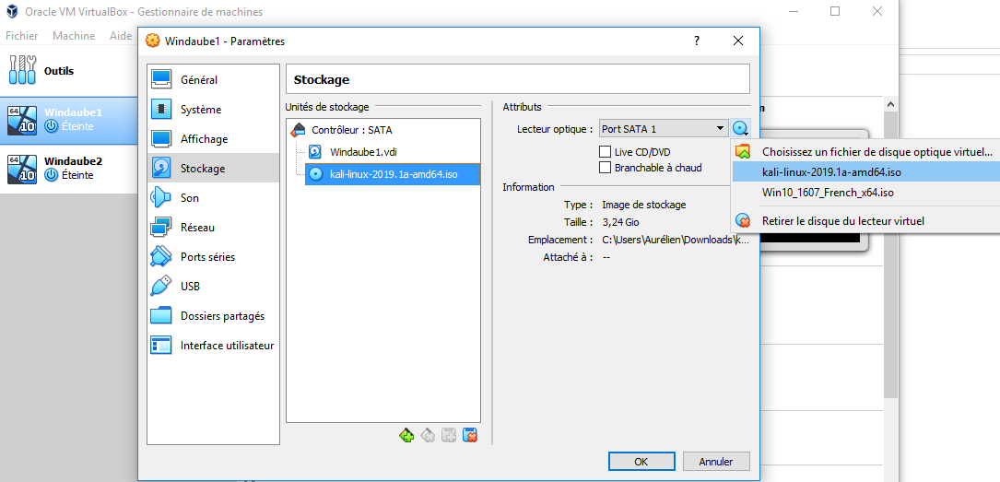
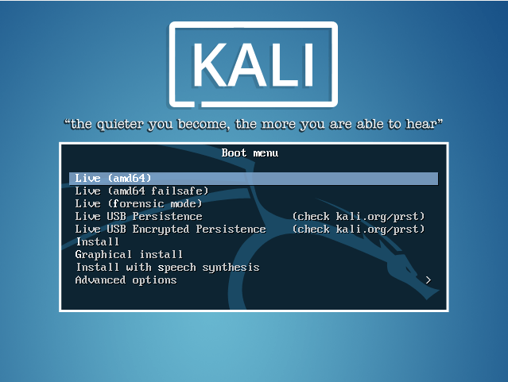
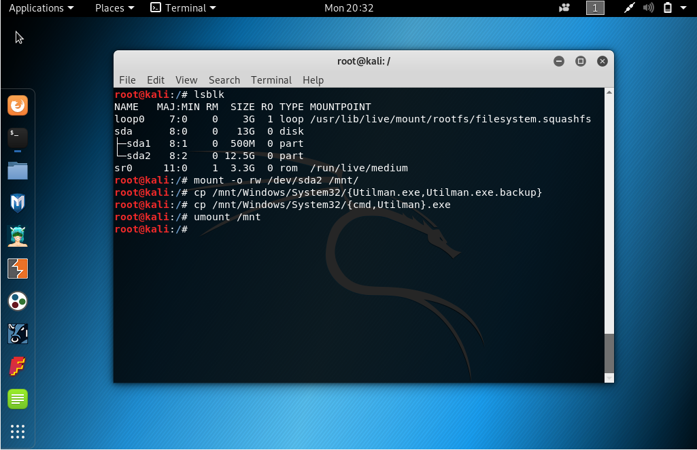
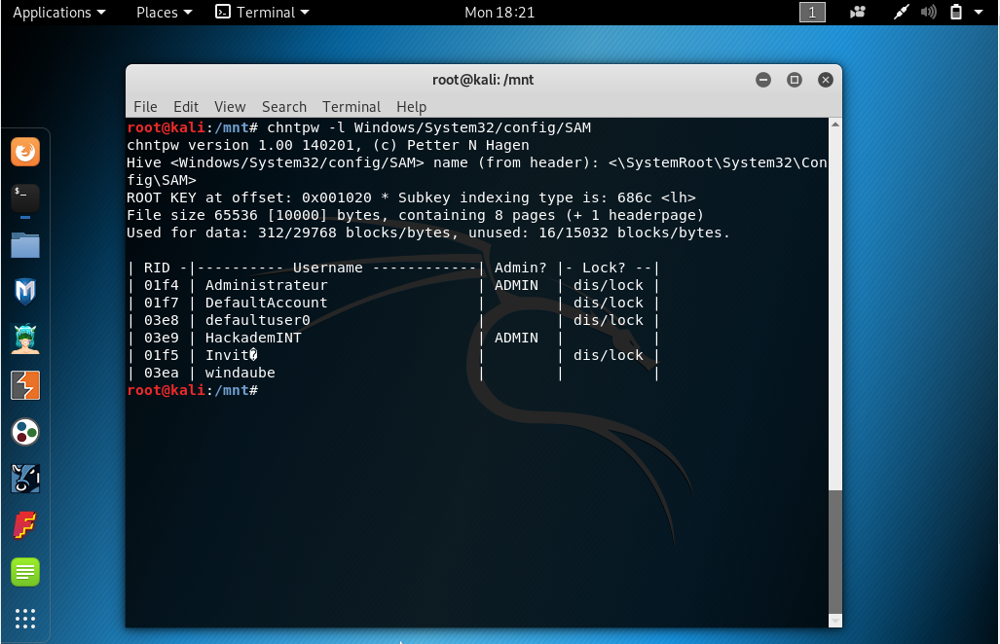
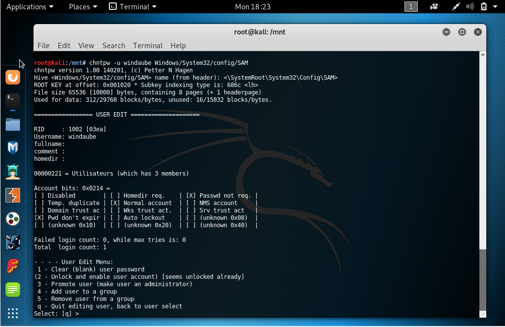
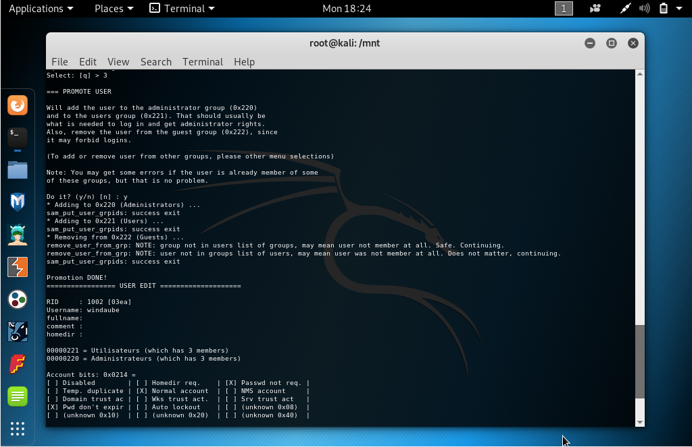
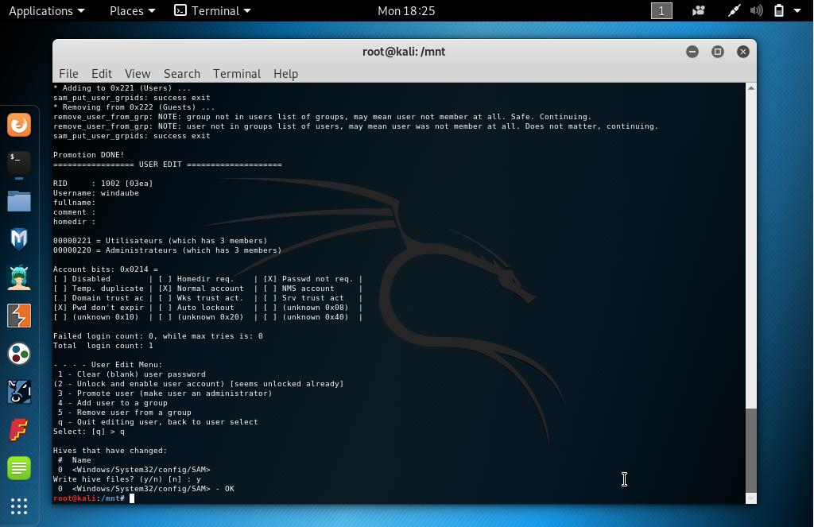

> This is the training section of my tutorial about Windows Hacking, you might
> check [this page](/Windows-Hacking) if you need to hack a real Windows operating
> system.

# Download the virtual machines

### Main source

<ul>
<li><a
href="https://data.hackademint.org/86152947f7952b8eff05a20c4a63f9f76e7663141ea28b7798441e1bedc03685a41d762a5fbf1752f662c8817d4a31f5b59cf8d0c647490895ecf6c5210d7f0d/Windaube1.ova">Windaube1.ova </a>(sha1sum: 5c6d1267a7090a1a9ee2158fce8616d6014ce306)</li>
<li><a
href="https://data.hackademint.org/86152947f7952b8eff05a20c4a63f9f76e7663141ea28b7798441e1bedc03685a41d762a5fbf1752f662c8817d4a31f5b59cf8d0c647490895ecf6c5210d7f0d/Windaube2.ova">Windaube2.ova</a> (sha1sum: 1583b98694d849f72b8695b0934f49c3db6218fd)</li>
</ul>

### Alternative source

<ul>
<li><a
href="https://windaube.minet.net/Windaube1.ova">Windaube1.ova </a>(sha1sum: 5c6d1267a7090a1a9ee2158fce8616d6014ce306)</li>
<li><a
href="https://windaube.minet.net/Windaube2.ova">Windaube2.ova</a> (sha1sum: 1583b98694d849f72b8695b0934f49c3db6218fd)</li>
</ul>

# Let's start the tutorial !

Uplaod the `ova`'s files into [VirtualBox](https://www.virtualbox.org/).

## Step 0: Boot on a live linux operating system

<ul>

<li>Download a linux ISO file (Kali 64 bits)

</li>

<li>Add the ISO to the configuration of the virtual machine

</li>

<li>Start the virtual machine and select `Live (amd64)`

</li>

</ul>

## Step 1: If you DO NOT get a user on the Windows system 

<ul>
<li>Mount the Windows partition with read/write option and replace Utilman.exe
(Utility Manager application of Windows) by cmd.exe in order to get an 
administrator shell without need to authenticate. In my case, `/dev/sda2` is the
Windows partition.

</li>
</ul>

## Step 1 bis: If you already get a user on the Windows system 

<ul>
<li>Mount the Windows partition with read/write option and promote your existing
user as an administrator using `chntpw` command. `windaube` is the unpriviledge
user that already exist on my Windows, replace it by yours when using `chntpw -u
&lt;user&gt; Windows/System32/config/SAM`.

</li>
</ul>

## Step 2: If you DO NOT get a user on the Windows system 

<ul>

</ul>
